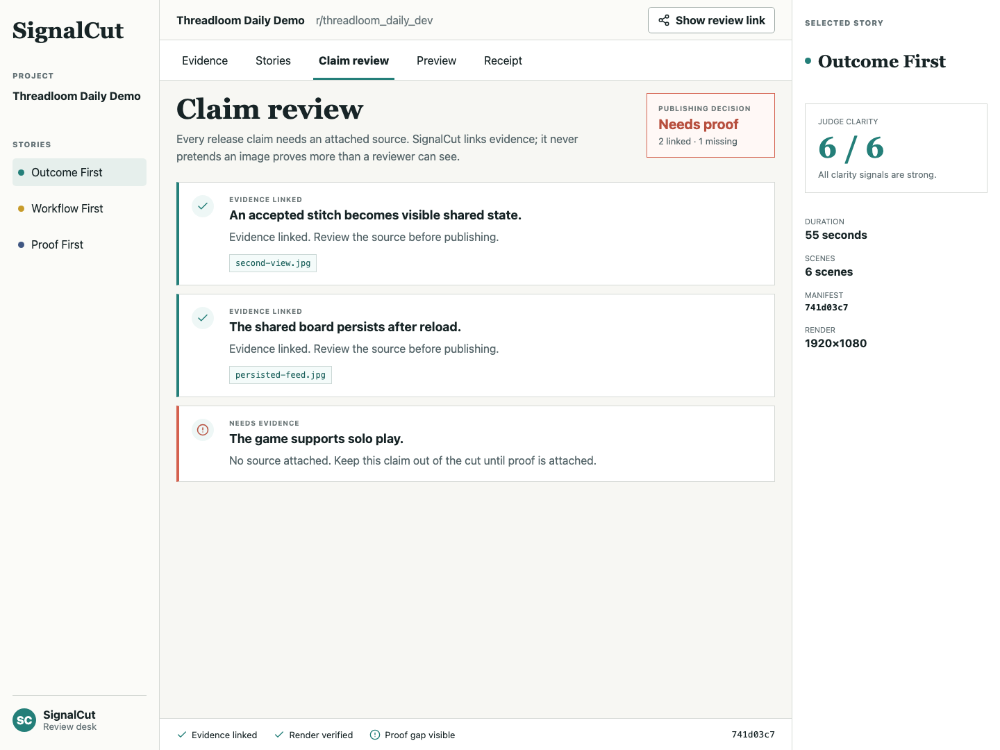

# SignalCut

SignalCut helps a hackathon builder turn real product evidence into a short,
reviewable demo cut without letting unsupported release claims slip through.

The July 19 **Claim Review** extension puts every claim beside its explicitly
attached source and makes the publishing decision visible before a demo goes
public.



## Try it

Open the live [SignalCut Review Desk](https://peanuts1605.github.io/signalcut/),
select **Claim review**, and inspect the intentionally unsupported solo-play
claim. The page is generated, rendered, and published by the same GitHub
workflow used for the included proof bundle.

## The problem

A polished demo can be assembled from real screenshots while still saying more
than those screenshots support. That is risky for a judge, a teammate, and a
product team trying to earn trust.

SignalCut gives a reviewer one concrete answer before release:

> Does every published claim have an explicit source a human can inspect?

It does not use an image model to pretend it can determine whether a screenshot
semantically proves a statement. It verifies the link, shows the source, and
leaves the final judgment with the reviewer.

## What Claim Review does

1. A project declares a publishing claim and the IDs of the evidence assets it
   relies on.
2. The engine writes a deterministic `claim-ledger.json`.
3. An unattached or unknown source becomes `needs_evidence`.
4. The overall decision is `NEEDS_PROOF` until every declared claim is linked.
5. The Review Desk makes the reason and source filenames visible in the same
   place a builder reviews the demo cut.

The bundled Threadloom proof contains two linked claims and one deliberately
unsupported claim. The correct decision is therefore `NEEDS_PROOF`, not a
false green light.

## Run it

Requirements: Python 3.11+ and Node.js 20+.

```bash
uv sync
uv run signalcut story fixtures/threadloom/project.json --out artifacts/threadloom
uv run pytest -q
uv run ruff check .

cd review/signalcut-desk
npm install
npm run dev
```

Open `http://127.0.0.1:4173`, choose **Claim review**, and inspect the three
claims. The unsupported “The game supports solo play.” claim must show **Needs
evidence** and the publishing decision must show **Needs proof**.

For a production build check:

```bash
cd review/signalcut-desk
npm run check
```

## Artifacts

`signalcut story` writes a portable proof bundle to `artifacts/threadloom/`:

- `evidence-manifest.json`: source images, dimensions, and SHA-256 hashes
- `story-candidates.json`: deterministic editorial candidates
- `selection-receipt.json`: selected cut and judge-clarity check
- `claim-ledger.json`: each publishing claim and its evidence-link decision
- `PUBLISHING_DECISION.md`: a short human-readable publishing result
- `storyboard.json` and `render-proof.json`: the selected sequence and rendered
  video provenance

The Review Desk copies those files into its local `public/proof/` folder for a
fully inspectable demo.

## OpenAI Build Week extension

SignalCut's original evidence-to-story pipeline predates OpenAI Build Week.
The Claim Review engine, Review Desk screen, responsive review state, tests,
and this documentation are the post-July-13 qualifying extension. Its exact
scope is documented in
[the qualifying-extension note](docs/OPENAI_BUILD_WEEK_QUALIFYING_EXTENSION_2026-07-19.md).

This extension was built with Codex during OpenAI Build Week. The submission
includes a short narrated demo asset and the primary-task `/feedback` session
ID `019ee0dc-d43c-7160-82ca-0cf8120952a8`.

## How Codex and GPT-5.6 contributed

The Claim Review extension was built in a dated Codex `gpt-5.6-terra` task during
the Build Week submission period. Codex helped turn the product premise into a
concrete data contract, build the claim-review engine and responsive Review
Desk, add adversarial coverage for missing and unknown sources, and run the
same proof bundle through local and GitHub Pages verification. Product
decisions stayed explicit: SignalCut checks declared evidence links, but a
human reviewer decides whether an image actually substantiates the claim.

The submitted Devpost entry uses the `/feedback` session ID for the project
task where the core extension was built, along with dated commit history and
the qualifying-extension note.

## Verification

Current local verification for the Claim Review extension:

- `12 passed` from the Python test suite
- Ruff clean
- Review Desk production build passes
- Desktop and 390px mobile review states rendered with no horizontal overflow
- The deterministic Threadloom bundle reports `2 linked`, `1 missing`, and
  `NEEDS_PROOF`

See [the demo script](docs/openai-build-week/DEMO_SCRIPT.md) and
[submission checklist](docs/openai-build-week/SUBMISSION_CHECKLIST.md) for the
judge path and remaining live-submission steps.

## License

SignalCut is released under the [MIT License](LICENSE).
